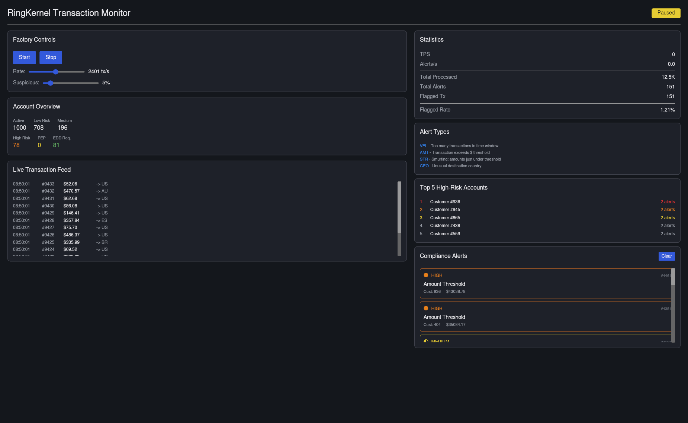
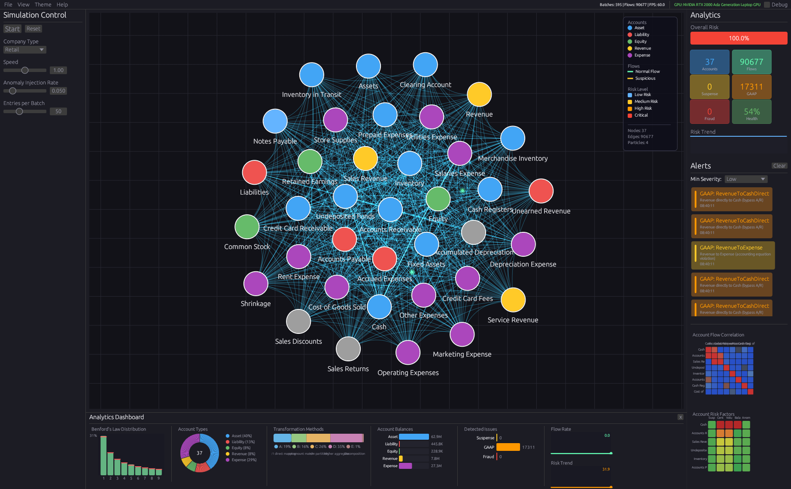
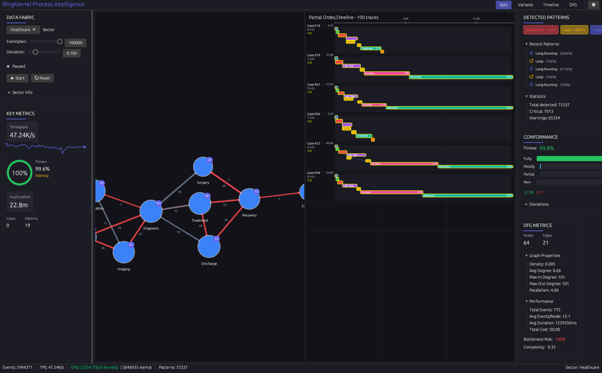

# Showcase Applications

RingKernel includes five comprehensive showcase applications demonstrating GPU-accelerated computing with the actor model. Each showcases different aspects of the framework.

---

## WaveSim - 2D Acoustic Wave Simulation


**Interactive wave propagation simulator** implementing the Finite-Difference Time-Domain (FDTD) method.

### Key Features

- **Tile-based Actor Model**: 16x16 cell tiles as actors with K2K messaging for halo exchange
- **Educational Modes**: Visualize computing paradigms from 1950s sequential to modern parallel
- **Multi-backend**: CPU (SoA + SIMD + Rayon), CUDA, and WGPU

### Performance

| Backend | 256x256 | 512x512 |
|---------|---------|---------|
| CPU SimulationGrid | 35,418 steps/s | 7,229 steps/s |
| **CUDA Packed** | **112,837 steps/s** | **71,324 steps/s** |

GPU vs CPU speedup: **3.1x at 256x256, 9.9x at 512x512**

### Run It

```bash
cargo run -p ringkernel-wavesim --release
```

Click anywhere on the canvas to inject wave impulses.

---

## WaveSim3D - 3D Acoustic Wave Simulation

**Comprehensive 3D acoustic wave simulation** with realistic physics, binaural audio, and volumetric visualization.

### Key Features

- **Realistic 3D Physics**: Temperature-dependent speed of sound, ISO 9613-1 atmospheric absorption, multiple media (air, water, metal)
- **3D FDTD Solver**: 7-point stencil Laplacian with CFL stability, absorbing boundary conditions
- **Binaural Audio**: Virtual head with ITD/ILD modeling, realistic ear spacing (~17cm)
- **Two GPU Computation Methods**:
  - **Stencil**: Traditional shared memory tiling for maximum throughput
  - **Actor**: Cell-as-actor paradigm with message-based halo exchange and HLC

### Visualization

- **Volumetric Ray Marching**: Real-time 3D pressure field rendering
- **Slice Views**: XY, XZ, and YZ plane cuts through the volume
- **Interactive Camera**: Orbit, pan, and zoom controls
- **Source/Listener Markers**: Visual feedback for audio positioning

### Audio Sources

| Type | Description |
|------|-------------|
| Impulse | Click/clap transients |
| Tone | Continuous sine wave |
| Chirp | Frequency sweep |
| Noise | White/pink noise |
| Gaussian | Gaussian pulse |
| WAV File | Audio file playback |

### Performance

| Grid Size | Backend | Performance |
|-----------|---------|-------------|
| 64³ cells | CPU (Rayon) | ~120 steps/sec |
| 64³ cells | CUDA | ~2000 steps/sec |
| 128³ cells | CUDA | ~400 steps/sec |

### Run It

```bash
# CPU backend
cargo run -p ringkernel-wavesim3d --release

# With CUDA acceleration
cargo run -p ringkernel-wavesim3d --release --features cuda
```

### Controls

| Key | Action |
|-----|--------|
| Space | Play/Pause |
| R | Reset simulation |
| I | Inject impulse |
| 1/2/3 | Toggle XY/XZ/YZ slice |
| Mouse | Orbit/Pan/Zoom camera |

---

## TxMon - Transaction Monitoring



**Real-time transaction monitoring** for banking/AML compliance scenarios with GPU-accelerated rule evaluation.

### Key Features

- **Transaction Factory**: Configurable synthetic generation with realistic patterns
- **Compliance Rules**: Velocity breach, amount threshold, structuring detection
- **Three GPU Approaches**:
  - Batch Kernel: Maximum throughput (~93B elem/sec)
  - Ring Kernel: Persistent actors with HLC and K2K messaging
  - Stencil Kernel: Pattern detection in transaction networks

### Performance

| Operation | Throughput |
|-----------|------------|
| Batch Kernel | ~93B elem/sec |
| Pattern Detection | ~15.7M TPS |

### Run It

```bash
cargo run -p ringkernel-txmon --release
```

---

## AccNet - Accounting Network Analytics



**GPU-accelerated accounting network analysis** transforming double-entry bookkeeping into graph analytics.

### Key Features

- **Network Visualization**: Interactive graph showing account relationships and money flows
- **Fraud Detection**: Circular flows, threshold clustering, Benford's Law violations
- **GAAP Compliance**: Automated detection of accounting rule violations
- **Temporal Analysis**: Seasonality, trends, behavioral anomalies

### GPU Kernels

1. **Suspense Detection**: Identifies suspicious clearing accounts
2. **GAAP Violation**: Checks for improper account pairings
3. **Benford Analysis**: Statistical analysis of first-digit distribution
4. **PageRank**: Network centrality and influence analysis

### Architecture

```
┌─────────────────┐     ┌──────────────────┐     ┌────────────────┐
│   Data Fabric   │────>│  GPU Kernels     │────>│  Visualization │
│ (Synthetic Gen) │     │ (CUDA/WGSL)      │     │  (egui Canvas) │
└─────────────────┘     └──────────────────┘     └────────────────┘
```

### Run It

```bash
# CPU backend
cargo run -p ringkernel-accnet --release

# With CUDA GPU acceleration
cargo run -p ringkernel-accnet --release --features cuda
```

---

## ProcInt - Process Intelligence



**GPU-accelerated process mining** for discovering, analyzing, and monitoring business processes from event logs.

### Key Features

- **DFG Mining**: Directly-Follows Graph construction from event streams with GPU acceleration
- **Pattern Detection**: Bottlenecks, loops, rework, and long-running activities
- **Conformance Checking**: Fitness and precision metrics against reference models
- **Timeline View**: Partial order traces with concurrent activity visualization
- **Multi-Sector**: Healthcare, Manufacturing, Finance, and IT process templates

### GPU Kernels

1. **DFG Construction**: Builds directly-follows graph from event stream (batch kernel)
2. **Pattern Detection**: Identifies process patterns like bottlenecks and loops
3. **Partial Order Derivation**: Builds precedence matrix from interval events (stencil kernel)
4. **Conformance Checking**: Validates traces against reference models

### Architecture

```
┌─────────────────┐     ┌──────────────────┐     ┌────────────────┐
│   Data Fabric   │────>│  GPU Kernels     │────>│  Visualization │
│ (Event Stream)  │     │ (DFG/Pattern)    │     │  (egui Canvas) │
└─────────────────┘     └──────────────────┘     └────────────────┘
        │                       │                       │
   Sector Templates      4 Kernel Types           Force-directed
   Anomaly Injection     CPU/CUDA fallback        DFG + Timeline
```

### Performance

| Operation | Throughput |
|-----------|------------|
| DFG Construction | ~47K events/sec |
| Pattern Detection | ~3.8M elements/sec |

### Run It

```bash
# CPU backend
cargo run -p ringkernel-procint --release

# Run benchmark
cargo run -p ringkernel-procint --bin procint-benchmark --release
```

---

## Common Patterns Across Showcases

All five applications demonstrate RingKernel's core capabilities:

| Pattern | WaveSim | WaveSim3D | TxMon | AccNet | ProcInt |
|---------|---------|-----------|-------|--------|---------|
| GPU Actor Model | Tile actors | Cell actors | Ring kernels | Analysis actors | DFG/Pattern kernels |
| K2K Messaging | Halo exchange | 3D halo exchange | Multi-stage pipeline | Network analysis | Kernel coordination |
| Real-time GUI | iced canvas | wgpu + egui | iced dashboard | egui graph canvas | egui DFG + Timeline |
| Multi-backend | CPU/CUDA/WGPU | CPU/CUDA | CPU/CUDA | CPU/CUDA | CPU/CUDA |
| HLC Timestamps | Tile ordering | Cell ordering | Transaction ordering | Event ordering | Trace ordering |
| Visualization | 2D pressure | 3D volume + slices | Alerts dashboard | Network graph | DFG + Timeline |

### Build All Showcases

```bash
# All showcases, CPU only
cargo build -p ringkernel-wavesim -p ringkernel-wavesim3d -p ringkernel-txmon -p ringkernel-accnet -p ringkernel-procint --release

# With CUDA support
cargo build -p ringkernel-wavesim -p ringkernel-wavesim3d -p ringkernel-txmon -p ringkernel-accnet -p ringkernel-procint --release --features cuda
```

---

## Next: [CUDA Code Generation](./13-cuda-codegen.md)
